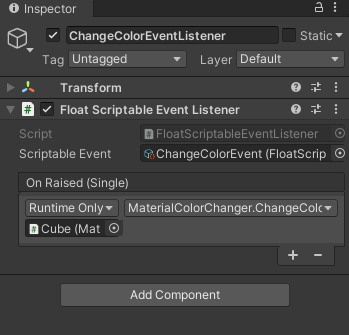

# Scriptable Events

[](https://unity3d.com/get-unity/download)
[](https://github.com/chark/scriptable-events/actions)
[](https://openupm.com/packages/com.chark.scriptable-events/)

Minimalistic and extensible event system implemented via `ScriptableObject`, inspired by [Unite2017](https://www.youtube.com/watch?v=raQ3iHhE_Kk).

<p align="center">
  
  
</p>

## Features

- Designer friendly
- Default event and listener implementations for common use-cases
- Code generation tools which can be used to create custom event and inspector scripts
- Strongly typed
- Custom icons
- Odin Inspector support

## Installation

This package can be installed via [OpenUPM](https://openupm.com/packages/com.chark.scriptable-events/):
```text
openupm add com.chark.scriptable-events
```

Or via the Unity Package Manager by [Installing from a Git URL](https://docs.unity3d.com/Manual/upm-ui-giturl.html):
```text
https://github.com/chark/scriptable-events.git#upm
```

Alternatively, manually install by adding the following entry to `Packages/manifest.json`:
```json
{
  "com.chark.scriptable-events": "https://github.com/chark/scriptable-events.git#upm"
}
```

If you'd like to install a specific release, replace `upm` suffix with version number, e.g., `v3.0.0`. You can find all releases [here](https://github.com/chark/scriptable-events/releases).

## Links

- [Documentation](../Packages/com.chark.scriptable-events/Documentation~/README.md)
- [Contributing](CONTRIBUTING.md)
- [Changelog](../Packages/com.chark.scriptable-events/CHANGELOG.md)
