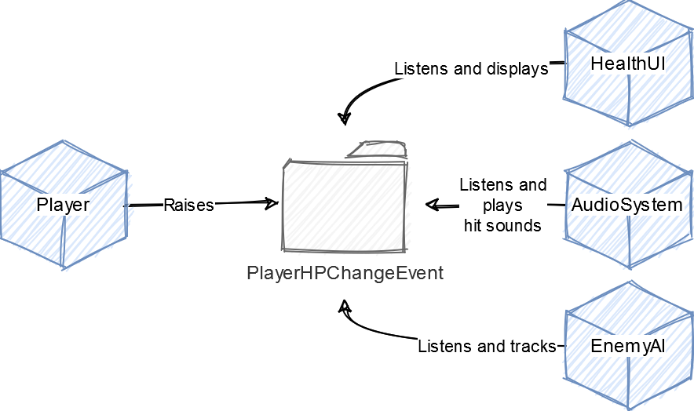

# Documentation

## Game Events
<p align="center">
  
</p>

Game events allow to decouple prefabs from direct dependencies such as scene or nested prefab game objects. The biggest benefit of events is that they can be referenced in isolated prefabs, this allows to later avoid having to set them up in the scene.

The package provides two types of game events:
- `GameEvent` without arguments.
- `ArgumentGameEvent` which accepts arguments (includes default implementations for commonly used types).

### Game event assets
The core of events is game event `ScriptableObject` assets. They store game event listeners and notify them when an event is raised. To use game events, create an appropriate game event type asset (where _"Argument Name"_ is the type of the argument that will be to passed to events):
- `GameEvent` - _Right Click -> Create -> Game Events -> Game Event_
- `ArgumentGameEvent` - _Right Click -> Create -> Game Events -> "Argument Name" Game Event_

Event assets can be referenced and raised in scripts directly or used in `UnityEvent` fields:
```cs
public class SceneManager : MonoBehaviour
{
    // Reference GameEvent directly.
    [SerializedField]
    private GameEvent startSceneGameEvent = default;

    // Or inside UnityEvent.
    [SerializedField]
    private UnityEvent onStartScene = default;

    private void Start()
    {
        if (startSceneGameEvent != null)
        {
            startSceneGameEvent.RaiseGameEvent();
        }

        onStartScene.Invoke();
    }
}
```

### Custom game events
To define a game event which accepts custom arguments, extend `GameEvents.Generic.ArgumentGameEvent`:
```cs
[CreateAssetMenu(fileName = "CustomGameEvent", menuName = "Game Events/Custom Game Event")]
public class CustomGameEvent : ArgumentGameEvent<Custom>
{
}
```

In order to enable raising of custom game events from the inspector, create a `CustomEditor` script and specify how the argument fields are going to be drawn. Extend `GameEvents.Generic.ArgumentGameEventEditor` and override `DrawArgumentField(Custom)`. Make sure to place this script under the `Editor` folder:
```cs
[CustomEditor(typeof(CustomGameEvent))]
public class CustomGameEventEditor : ArgumentGameEventEditor<CustomGameEvent, Custom>
{
    protected override Custom DrawArgumentField(Custom value)
    {
        // Draw Custom value input fields here.
    }
}
```

### Game event listeners
Game events can be listened to by listener components. To use listeners, add an appropriate listener component via:
- `GameEvent` - _Add Component -> Game Events -> Game Event Listener_
- `ArgumentGameEvent` - _Add Component -> Game Events -> "Argument Name" Game Event Listener_

Once the component is added, slot in the appropriate `GameEvent` asset to the listener and add insert response methods to `onGameEvent` callback via the inspector.

### Custom game event listeners
Custom game event listeners which accept different arguments can also be created. Create a `UnityEvent` which would accept the `Custom` type:
```cs
[Serializable]
public class CustomEvent : UnityEvent<Custom>
{
}
```

Then, create a custom game event listener by extending `GameEvents.Generic.ArgumentGameEventListener`.
```cs
[AddComponentMenu("Game Events/Custom Game Event Listener")]
public class CustomGameEventListener : ArgumentGameEventListener<CustomGameEvent, CustomEvent, Custom>
{
}
```

### Examples
Import the `GameEvents` sample which shows how to use game events in various situations.

## Mutable Objects
<p align="center">
  
</p>

Mutable objects allow using `ScriptableObject` assets to store and share data. They are handy when a lot of behaviours need access to specific data. In such cases, mutable objects can be injected in dependant behaviours instead of forming hard dependencies between them or using singletons.

### Mutable object assets
The package provides mutable objects for most commonly used types such as `MutableInt`, `MutableFloat`, etc. Mutable object assets can be created by (where _"Value Name"_ is the type name of the contained value):
- `MutableObject` - _Right Click -> Create -> Mutable Objects -> Mutable "Value Name"_

The core of events is game event `ScriptableObject` assets. They store game event listeners and notify them when an event is raised. To use game events, create an appropriate game event type asset (where _"Argument Name"_ is the type of the argument that will be to passed to events):
- `GameEvent` - _Right Click -> Create -> Game Events -> Game Event_
- `ArgumentGameEvent` - _Right Click -> Create -> Game Events -> "Argument Name" Game Event_

### Custom mutable objects
Using mutable objects for each individual field can be troublesome in cases where a lot of values need to be observed. In such a situation it is better to create a single mutable object to house those values by extending `MutableObject` and overriding `ResetValues()`:
```cs
[CreateAssetMenu(fileName = "MutableCustom", menuName = "Mutable Objects/Mutable Custom")]
public class MutableCustom : MutableObject
{
    [SerializeField]
    private int health = default;

    [SerializeField]
    private int armor = default;

    [SerializeField]
    private int xp = default;

    public int Health { get; set; }

    public int Armor { get; set; }

    public int Xp { get; set; }

    // Set property values when mutable object is enabled or if the values change in the inspector.
    public override void ResetValues()
    {
        Health = health;
        Armor = armor;
        Xp = xp;
    }
}
```

After that is set up, make sure to call `MutableObjectExtensions.ResetMutatedObjects()` somewhere in one of the `Awake` methods, each time before a scene loads. Make sure the script which calls this extension executes before other scripts by setting up [Script Execution Order](https://docs.unity3d.com/Manual/class-MonoManager.html).

### Examples
Import the `MutableObject` sample which shows how to use game events in various situations.
