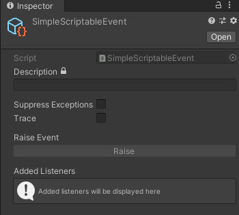
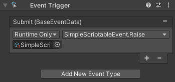
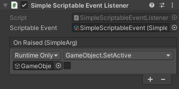
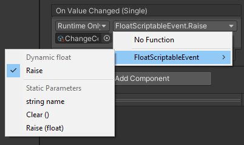

# Documentation
Most of the documented features can be imported as samples via Unity Package Manager or taken directly from [Samples](../Samples%7E) directory.

## Table of contents
- [General](#general)
- [Simple events](#simple-events)
- [Events with arguments](#events-with-arguments)
- [Custom events](#custom-events)

## General

### Tips
- When creating prefabs, event assets can be referenced in them. Then, when you add in your prefabs into a scene, no additional setup is necessary!
- Event assets can be used to communicate between scenes, this is particularly useful when using [Multi Scene Editing](https://docs.unity3d.com/Manual/MultiSceneEditing.html).

### Event asset GUI
<p align="center">
  
</p>

- Description - custom description for the event, what it does, etc, [Rich Text](https://docs.unity3d.com/Packages/com.unity.ugui@1.0/manual/StyledText.html) is also supported.
- Lock button - disables the _Description_ field, useful to avoid accidental edits.
- Suppress Exceptions - if an event has more than one listener, the first listener to throw an exception will break the chain. When enabled, the exception will get logged and other listeners will continue firing.
- Trace - enable additional logging.
- Raise Event - _Raise_ the event, available only in Play Mode.
- Added Listeners - shows listeners which are subscribed to the event, available only in Play Mode.

## Simple Events
Simple events are useful when you need to _ping_ a `MonoBehaviour` in order to trigger an action. For example, the player loses, and the game needs to show a game over screen (complete example can be found [here](../Samples~/SimpleEvents)).

### Event asset
To create a simple event, _right click_ in the _Project_ window, and select _Create -> Scriptable Events -> Simple Scriptable Event_. This will create a `SimpleScriptableEvent` asset file, you can name the file however you like and place it anywhere in your project.

### Raise event
After you have prepared the event, you will want to _Raise_ it. This can be done by dragging the event asset into any `UnityEvent` available on one of your `MonoBehaviour` and selecting the `Raise` method:
<p align="center">
  
</p>

Alternatively you can _Raise_ the event from within a script:
```cs
[SerializedField]
private SimpleScriptableEvent simpleScriptableEvent;

...

simpleScriptableEvent.Raise();
```

### Event listener
Next thing you will need is a listener, select any `GameObject` in the scene, click _Add Component_ and select _Scriptable Events -> Simple Scriptable Event Listener_. Then, slot in the event asset in _Scriptable Event_ field and add a callback to the _On Raised_ `UnityEvent` under the listener which will invoke a method on a `MonoBehaviour`:
<p align="center">
  
</p>

Alternatively, you can subscribe to an event via a script:
```cs
public class CustomListener : MonoBehaviour, IScriptableEventListener<SimpleArg>
{
    [SerializeField]
    private SimpleScriptableEvent simpleScriptableEvent;

    public void OnRaised(SimpleArg arg)
    {
        // Handle event.
    }

    private void OnEnable()
    {
        simpleScriptableEvent.Add(this);
    }

    private void OnDisable()
    {
        simpleScriptableEvent.Remove(this);
    }
}
```

## Events with arguments
Events with arguments are useful when you need to pass around data instead of just _pinging_. For example, the player picks up a coin, and you need to increment the score counter by a certain amount based on the coins value (complete example can be found [here](../Samples~/EventsWithArguments)).

### Event asset
To create an event with an argument, the approach is similar to [Simple Events](#simple-events). Simply _right click_ in the _Project_ window, and select _Create -> Scriptable Events -> {Type} Scriptable Event_, where _{Type}_ is the type of the data you want to pass.

### Raise event
To _Raise_ event with an argument, you will first need a `UnityEvent` that accepts a value of desired type. For each `ScriptableEvent` exists a `UnityEvent` with given type (see `ScriptableEvents.{Type}.{Type}UnityEvent` for existing implementations).

After that is sorted, you will need to expose the `UnityEvent` and `Invoke` it in your script, for example a `UnityEvent` that accepts `float` would looks like:
```cs
[SerializedField]
private ScriptableEvents.Float.FloatUnityEvent floatUnityEvent;

...

floatUnityEvent.Invoke(1.0f);
```

Then, to raise the `ScriptableEvent`, drag it into the exposed `UnityEvent` of specific type and select the **Dynamic** `Raise` method. This will ensure that the value passed to the `UnityEvent` gets forwarded to the `Raise` method:
<p align="center">
  
</p>

Alternatively, you can _Raise_ the event from a script:
```cs
[SerializedField]
private FloatScriptableEvent floatScriptableEvent;

...

floatScriptableEvent.Raise(1.0f);
```

### Event listener
Next thing you will need is a listener. The approach of adding a listener is similar to [Simple Events](#simple-events) as well. Select any `GameObject` in the scene, click _Add Component_ and select _Scriptable Events -> {Type} Scriptable Event Listener_. The only difference is that when selecting your method, you must select a **Dynamic** method.

When subscribing via a script, you will also need to specify a different type argument rather than using `SimpleArg`, in this example `float` is used:
```cs
public class CustomListener : MonoBehaviour, IScriptableEventListener<float>
{
    [SerializeField]
    private FloatScriptableEvent floatScriptableEvent;

    public void OnRaised(float arg)
    {
        // Handle event.
    }

    private void OnEnable()
    {
        floatScriptableEvent.Add(this);
    }

    private void OnDisable()
    {
        floatScriptableEvent.Remove(this);
    }
}
```

## Custom Events
You can also create custom events where you can pass any kind of data. For example, the player loses, and you want to send the reference to the player, and the enemy which collided with the player (complete example can be found [here](../Samples~/CustomEvents)).

First define the data that you want to send:
```cs
public class CustomData
{
    public float ValueA { get; }

    public int ValueB { get; }

    public MaterialData(float valueA, int valueB)
    {
        ValueA = valueA;
        ValueB = valueB;
    }
}
```

Similarly to [Events with arguments](#events-with-arguments) you will need a `UnityEvent` which accepts your custom data type:
```cs
[Serializable]
public CustomDataUnityEvent : UnityEvent<CustomData>
{
}
```

Next up, define the scriptable event:
```cs
[CreateAssetMenu(
    fileName = "CustomDataScriptableEvent",
    menuName = "Custom Scriptable Events/Custom Data Scriptable Event"
)]
public class CustomDataScriptableEvent : BaseScriptableEvent<CustomData>
{
}
```

Finally, create a listener which will glue everything together:
```cs
[AddComponentMenu("Custom Scriptable Events/Custom Data Event Listener")]
public class CustomDataScriptableEventListener
    : BaseScriptableEventListener<
        CustomDataScriptableEvent,
        CustomDataUnityEvent,
        CustomData
    >
{
}
```

After setting everything, you can use your custom event the same way as described in [Events with arguments](#events-with-arguments). However, you will not be able to use additional GUI features as with built-in events. To solve this, define a custom editor script (make sure to place it under `Editor` directory):
```cs
[CustomEditor(typeof(CustomDataScriptableEvent))]
public class CustomDataScriptableEventEditor : BaseScriptableEventEditor<CustomData>
{
    protected override CustomData DrawArgField(CustomData value)
    {
        // Initially the value will be null as BaseScriptableEventEditor does not know how to
        // construct an instance of CustomData.
        if (value == null)
        {
            return new CustomData(0f, 0);
        }

        // Add input fields under the inspector. Note that these can also be objects - you can drag
        // them in from the scene window!

        // Also note that you can omit this step if your data is complex. For example,
        // SimpleScriptableEvent does not render any fields.
        EditorGUILayout.BeginVertical();
        var valueA = EditorGUILayout.FloatField("Value A", value.ValueA);
        var valueB = EditorGUILayout.IntField("Value B", value.ValueB);
        EditorGUILayout.EndVertical();

        return new CustomData(valueA, valueB);
    }
}
```
