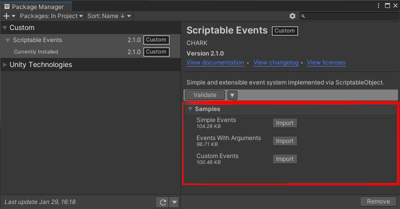

[Unity Event]: https://docs.unity3d.com/ScriptReference/Events.UnityEvent.html
[Samples~]: ../Samples%7E

# Documentation

## Samples
The documented features can be imported as samples via _Unity Package Manager_ from the [Samples~] directory:
<p align="center">
  
</p>

## Getting Started
The simplest use case of _Scriptable Events_ is when you want to notify a system that something happened without providing any context. To do so, you need two elements: a _Simple Scriptable Event_ and a _Simple Scriptable Event Listener_.

First, create a _Simple Scriptable Event_ asset by right-clicking in the project window and selecting _Scriptable Events/Simple Scriptable Event_. You can name the event as you'd like and place it anywhere in your project:
<p align="center">
  
</p>

Next, select a _GameObject_ of your liking in the scene and add a _Simple Scriptable Event listener_:
<p align="center">
  
</p>

Once you've added a listener, insert your event asset into the _Scriptable Event_ field (1). In the _On Raised_ [Unity Event] field (2), insert the methods you'd like to be triggered by the event.

For example, if you wanted to change a color of an object, your setup might look like the following (as seen in the _Simple Events_ sample):
<p align="center">
  
</p>

Now that you have your listener ready, you need to trigger the event. This can be done from a [Unity Event] via the `Raise` method or by selecting the event asset and clicking the _Raise_ button when the game is running:
<p align="center">
  
  
</p>

Alternatively you can trigger the event via code:
```cs
using ScriptableEvents.Events;
using UnityEngine;

public class TriggerEvent : MonoBehaviour
{
    [SerializeField]
    private SimpleScriptableEvent scriptableEvent;

    private void Start()
    {
        scriptableEvent.Raise();
    }
}
```

## Passing Arguments
In most situations you'll want to pass an argument when triggering an event. For example, if the player takes damage, you want to notify your systems with the amount of damage taken.

For such uses cases, this package provides a set of events with commonly used argument types. To create an event asset which accepts an argument, right-click in the project window and select an event from _Scriptable Events/_ menu which has the required type:
<p align="center">
  
</p>

Next, you'll want to add a listener. Each corresponding _Scriptable Event_ type provides a listener component. Each typed listener works in the same fashion as _Simple Scriptable Event Listener_. The only caveat is when inserting your methods into the _On Raised_ [Unity Event] field. In this case make sure to select a **dynamic** method:
<p align="center">
  
  
</p>

To trigger the event follow the same steps as with _Simple Scriptable Event_. However, make sure to select a **dynamic** `Raise` method:
<p align="center">
  
</p>

Alternatively you can trigger the event via code:
```cs
using ScriptableEvents.Events;
using UnityEngine;

public class TriggerEvent : MonoBehaviour
{
    [SerializeField]
    private FloatScriptableEvent scriptableEvent;

    private void Start()
    {
        // Your argument value.
        var value = 1.0f;

        scriptableEvent.Raise(value);
    }
}
```
