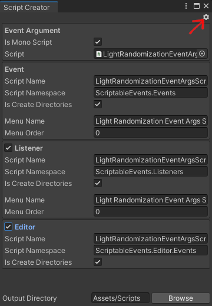
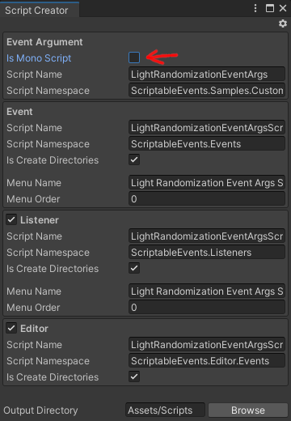

[Unity Package Manager]: https://docs.unity3d.com/Manual/upm-ui.html
[Unity Event]: https://docs.unity3d.com/ScriptReference/Events.UnityEvent.html
[Samples~]: ../Samples%7E
[Simple Events]: ../Samples%7E/SimpleEvents
[Events With Arguments]: ../Samples%7E/EventsWithArguments
[Custom Events]: ../Samples%7E/CustomEvents
[ExecuteInEditMode]: https://docs.unity3d.com/ScriptReference/ExecuteInEditMode.html

# Documentation

## Samples
The documented features can be imported as samples via [Unity Package Manager] from the [Samples~] directory. When stuck, make sure to investigate the corresponding sample:
<p align="center">
  
</p>

The samples can also be accessed directly from:
- [Simple Events]
- [Events With Arguments]
- [Custom Events]

## Getting started
The simplest use case of _Scriptable Events_ is when a system needs to be notified that something happened without providing any context. To do so, the following elements are needed:
- _Simple Scriptable Event_ asset which holds the listeners and is used to trigger the event
- _Simple Scriptable Event Listener_ component which reacts to an event being triggered

### How to Trigger Events
First, create a _Simple Scriptable Event_ asset by right-clicking in the _Project Window_ and selecting _Create/Scriptable Event/Simple Scriptable Event_. The event asset can be renamed and placed anywhere in the project:
<p align="center">
  
</p>

Next, create a new _GameObject_ in the scene and add a _Simple Scriptable Event Listener_ component:
<p align="center">
  
</p>

Once a listener component is added, do the following:
- Insert event asset into the _Scriptable Event_ field
- Add the methods to be triggered by the event into the _On Raised_ [Unity Event] field,

For example, if lights need to be turned off, the listener might be setup as follows (as seen in [Simple Events] sample):
<p align="center">
  
</p>

Now that the listener is ready, the event needs to be triggered. This can be done in the following ways:
- Using a [Unity Event] and selecting the `SimpleScriptableEvent.Raise()` method
- Selecting the event asset and clicking the _Raise_ button (debug)
- Selecting the event asset and clicking the _Raise_ button next to a specific listener (debug)

<p align="center">
  
  
</p>

### How to Trigger Events in a Custom Components
In most cases events will be raised from custom components. The recommended way to do so is to define a [Unity Event] field and raise the event asset there as described previously. This approach will give the most flexibility but will be harder to debug:
```cs
using ScriptableEvents.Events;
using UnityEngine;

public class TriggerEvent : MonoBehaviour
{
    [SerializeField]
    private UnityEvent onTriggered;

    private void Start()
    {
        onTriggered.Invoke();
    }
}
```

Alternatively, the event asset can be directly referenced and the `SimpleScriptableEvent.Raise` method can be called to trigger it. This provides better traceability but is less flexible than the [Unity Event] approach:
```cs
using ScriptableEvents.Events;
using UnityEngine;

public class TriggerEvent : MonoBehaviour
{
    [SerializeField]
    private SimpleScriptableEvent scriptableEvent;

    private void Start()
    {
        scriptableEvent.Raise();
    }
}
```

## Passing Arguments
Often systems will require some context when they're being triggered. To solve this, this package provides a set of events with commonly used types which can be used to carry information.

### How to Trigger Events with Arguments
To create an event asset which carries information, right-click in the _Project Window_ and select an event with a specific type from _Create/Scriptable Event/*_:
<p align="center">
  
</p>

Next, a listener for this specific event type must be added into the scene. Each _Scriptable Event_ type contains a corresponding listener component. Typed event listeners work the same way as _Simple Scriptable Event Listener_ components, the only caveat is that when selecting methods in the _On Raised_ [Unity Event] field, **dynamic** methods have to be selected:
<p align="center">
  
  
</p>

To trigger the event, follow the same steps as with _Simple Scriptable Event_. Again, make sure to select a **dynamic** `Raise` method:
<p align="center">
  
</p>

A more concrete example of this can be seen in [Events With Arguments] sample.

### How to Trigger Events with Arguments in Custom Components
When raising events with arguments in code, it is also recommended to use [Unity Event] fields. However, when defining the event field, type information needs to be specified as well:
```cs
using UnityEngine;
using UnityEngine.Events;

public class TriggerEvent : MonoBehaviour
{
    [SerializeField]
    private UnityEvent<float> onTriggered;

    private void Start()
    {
        // Argument value.
        var value = 1.0f;

        onTriggered.Invoke(value);
    }
}
```

Alternatively, the event asset can be referenced and the `SimpleScriptableEvent.Raise(TArg)` method can be called to trigger the event:
```cs
using ScriptableEvents.Events;
using UnityEngine;

public class TriggerEvent : MonoBehaviour
{
    [SerializeField]
    private FloatScriptableEvent scriptableEvent;

    // Also works:
    // [SerializeField]
    // private BaseScriptableEvent<float> scriptableEvent;

    private void Start()
    {
        // Argument value.
        var value = 1.0f;

        scriptableEvent.Raise(value);
    }
}
```

## Creating Custom Events
In some cases using the built-in argument types is not sufficient. This can happen when a system needs to handle custom data types. To integrate a custom data type into the _Scriptable Events_ package, the following scripts are required:
- The custom data type script
- _Scriptable Event_ asset script
- _Scriptable Event Listener_ script (optional if subscribing manually)
- _Scriptable Event Editor_ script (optional)

To simplify script creation workflow, this package provides a _Script Creator_ tool which can be used to automate this process. As an example, lets assume that we need to integrate the data type which looks like the following and exists in a `LightRandomizationEventArgs.cs` script:
```cs
public class LightRandomizationEventArgs
{
    public float Intensity { get; set; }

    public Color Color { get; set; }
}
```

First, right-click the script which defines the data type and select _Create/Scriptable Event/Custom Scriptable Event_ (at the bottom):

<p align="center">
  
</p>

This will open the _Script Creator_ window:

<p align="center">
  
  
</p>

The _Script Creator_ window provides the following options:
- **Gear icon** - allows saving defaults for the _Script Creator_ window, this is useful when creating scripts in bulk or when a strict project structure is in place
- **Event Argument** - allows customizing how the argument data type information is retrieved during script generation:
  - **Is Mono Script** - should a `MonoScript` be used to fetch the type information
  - **Script** - the script to be used as an argument type
  - **Script Name** - name of the argument type
  - **Script Namespace** - namespace of the argument type
- **Event** - allows customizing how the event asset script code wil be generated:
  - **Script Name** - event type and script name
  - **Script Namespace** - event type namespace
  - **Is Create Directories** - should event namespace create directories
  - **Menu Name** - name of the event in context menu
  - **Menu Order** - order of the event in context menu
- **Listener** - allows customizing how the listener component code wil be generated:
  - **Script Name** - listener type and script name
  - **Script Namespace** - listener type namespace
  - **Is Create Directories** - should listener namespace create directories
  - **Menu Name** - name of the listener in component context menu
  - **Menu Order** - order of the listener in component context menu
- **Editor** - allows customizing how the listener component code wil be generated:
  - **Script Name** - editor type and script name
  - **Script Namespace** - editor type namespace
  - **Is Create Directories** - should editor namespace create directories
- **Output Directory** - where to save generated code

Making some adjustments to the fields and clicking **Create** in this specific example will result in following scripts (as seen in [Custom Events] sample).

First, the _Scriptable Event_ script:
```cs
using UnityEngine;

namespace ScriptableEvents.Events
{
    [CreateAssetMenu(
        fileName = "LightRandomizationScriptableEvent",
        menuName = ScriptableEventConstants.MenuNameCustom + "/Light Randomization Scriptable Event",
        order = ScriptableEventConstants.MenuOrderCustom + 0
    )]
    public class LightRandomizationScriptableEvent : BaseScriptableEvent<LightRandomizationEventArgs>
    {
    }
}
```

_Scriptable Event Listener_ script:
```cs
using UnityEngine;

namespace ScriptableEvents.Events
{
    [AddComponentMenu(
        ScriptableEventConstants.MenuNameCustom + "/Light Randomization Scriptable Event Listener",
        ScriptableEventConstants.MenuOrderCustom + 0
    )]
    public class LightRandomizationScriptableEventListener : BaseScriptableEventListener<LightRandomizationEventArgs>
    {
    }
}
```

The optional _Scriptable Event Editor_ script (note that the generated editor script is a placeholder):
```cs
using ScriptableEvents.Editor;
using UnityEditor;
using UnityEngine;

namespace ScriptableEvents.Editor.Events
{
    [CustomEditor(typeof(LightRandomizationScriptableEvent))]
    public class LightRandomizationScriptableEventEditor : BaseScriptableEventEditor<LightRandomizationEventArgs>
    {
        protected override LightRandomizationEventArgs DrawArgField(LightRandomizationEventArgs value)
        {
            // Use EditorGUILayout.TextField, etc., to draw inputs next to Raise button on the
            // LightRandomizationEventScriptableEvent asset.
            return value;
        }
    }
}
```

In order to fully utilize the editor script, the input fields have to be manually defined, for example (as seen in [Custom Events] sample):
```cs
using ScriptableEvents.Editor;
using UnityEditor;
using UnityEngine;

namespace ScriptableEvents.Editor.Events
{
    [CustomEditor(typeof(LightRandomizationScriptableEvent))]
    public class LightRandomizationScriptableEventEditor : BaseScriptableEventEditor<LightRandomizationEventArgs>
    {
        protected override LightRandomizationEventArgs DrawArgField(LightRandomizationEventArgs value)
        {
            if (value == null)
            {
                value = new LightRandomizationEventArgs();
            }

            EditorGUILayout.BeginVertical();
            value.Intensity = EditorGUILayout.FloatField("Intensity", value.Intensity);
            value.Intensity = Mathf.Max(0, value.Intensity);

            value.Color = EditorGUILayout.ColorField("Color", value.Color);
            EditorGUILayout.EndVertical();

            return value;
        }
    }
}
```

Finally, in order to create the event asset for the newly generated script, select _Create/Scriptable Events (custom)/Light Randomization Scriptable Event Listener_:

<p align="center">
  
</p>

Using the custom event asset is the same as working with scripts with arguments and simple events.

## Manually Subscribing to Events
It is recommended to use pre-defined and custom listener components to subscribe to events. However, when traceability is important, subscribing to events manually via non-listener components is preferable.

There are two approaches that can be used to subscribe to an event, the first one is implementing `IScriptableEventListener<TArg>` and calling `AddListener(this)` (don't forget to call `RemoveListener(this)` at some point to avoid memory leaks):
```cs
public class CustomEventListener : MonoBehaviour, IScriptableEventListener<float>
{
    [SerializeField]
    private FloatScriptableEvent scriptableEvent;

    // Also works:
    // [SerializeField]
    // private BaseScriptableEvent<float> scriptableEvent;

    private void OnEnable()
    {
        scriptableEvent.AddListener(this);
    }

    private void OnDisable()
    {
        scriptableEvent.RemoveListener(this);
    }

    public void OnRaised(float value)
    {
        // Handle event...
    }
}
```

The second approach is more flexible and allows to specify any method that matches the event type in `AddListener(Action<TArg>)` overload (again don't forget to call the `RemoveListener(Action<TArg>)`):
```cs
public class CustomEventListener : MonoBehaviour
{
    [SerializeField]
    private FloatScriptableEvent scriptableEvent;

    // Also works:
    // [SerializeField]
    // private BaseScriptableEvent<float> scriptableEvent;

    private void OnEnable()
    {
        scriptableEvent.AddListener(OnRaised);
    }

    private void OnDisable()
    {
        scriptableEvent.RemoveListener(OnRaised);
    }

    private void OnRaised(float value)
    {
        // Handle event...
    }
}
```

Note that when using these approaches to subscribe to events, some functionality in the custom inspectors that are included in this package might be lost. For example, the functionality to click on `UnityEngine.Object` references in _Scriptable Event_ assets.
