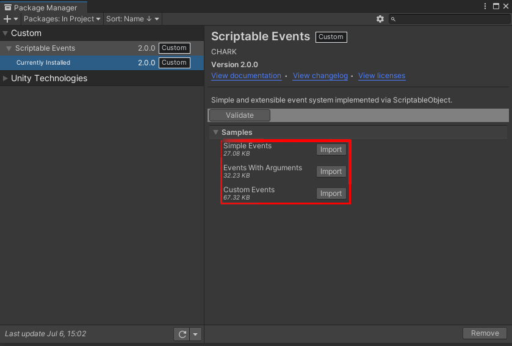
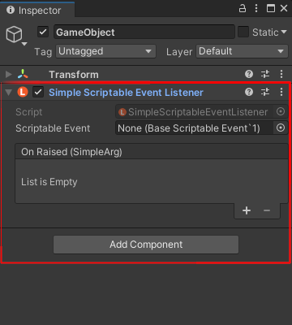
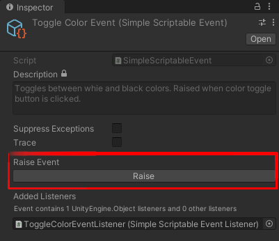
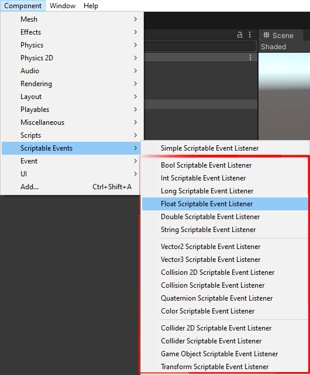
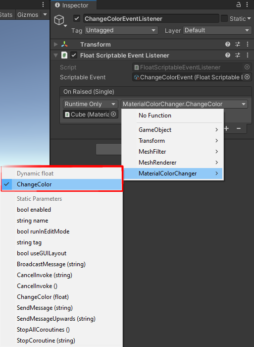
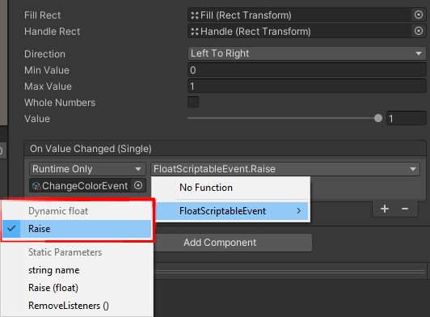

[Unity Event]: https://docs.unity3d.com/ScriptReference/Events.UnityEvent.html
[Samples~]: ../Samples%7E
[Simple Events]: ../Samples%7E/SimpleEvents
[Events With Arguments]: ../Samples%7E/EventsWithArguments
[Custom Events]: ../Samples%7E/CustomEvents

# Documentation

## Samples
The documented features can be imported as samples via _Unity Package Manager_ from the [Samples~] directory:
<p align="center">
  
</p>

## Getting Started
The simplest use case of _Scriptable Events_ is when you want to notify a system that something happened without providing any context. To do so, you need two elements: a _Simple Scriptable Event_ and a _Simple Scriptable Event Listener_.

First, create a _Simple Scriptable Event_ asset by right-clicking in the project window and selecting _Scriptable Events/Simple Scriptable Event_. You can name the event as you'd like and place it anywhere in your project:
<p align="center">
  
</p>

Next, select a _GameObject_ of your liking in the scene and add a _Simple Scriptable Event listener_:
<p align="center">
  
</p>

Once you've added a listener, insert your event asset into the _Scriptable Event_ field (1). In the _On Raised_ [Unity Event] field (2), insert the methods you'd like to be triggered by the event.

For example, if you wanted to change a color of an object, your setup might look like the following as seen in the _Simple Events_ sample:
<p align="center">
  
</p>

Now that you have your listener ready, you need to trigger the event. This can be done from a [Unity Event] via the `Raise` method or by selecting the event asset and clicking the _Raise_ button when the game is running:
<p align="center">
  
  
</p>

Alternatively you can trigger the event via code:
```cs
using ScriptableEvents.Events;
using UnityEngine;

public class TriggerEvent : MonoBehaviour
{
    [SerializeField]
    private SimpleScriptableEvent scriptableEvent;

    private void Start()
    {
        scriptableEvent.Raise();
    }
}
```

## Passing Arguments
In most situations you'll want to pass an argument when triggering an event. For example, if the player takes damage, you want to notify your systems with the amount of damage taken (the following examples are based on [Events With Arguments] sample).

For such uses cases, this package provides a set of events with commonly used argument types. To create an event asset which accepts an argument, right-click in the project window and select an event from _Scriptable Events/_ menu which has the required type:
<p align="center">
  
</p>

Next, you'll want to add a listener. Each corresponding _Scriptable Event_ type provides a listener component. Each typed listener works in the same fashion as _Simple Scriptable Event Listener_. The only caveat is when inserting your methods into the _On Raised_ [Unity Event] field. In this case make sure to select a **dynamic** method:
<p align="center">
  
  
</p>

To trigger the event follow the same steps as with _Simple Scriptable Event_. However, make sure to select a **dynamic** `Raise` method:
<p align="center">
  
</p>

Alternatively you can trigger the event via code:
```cs
using ScriptableEvents.Events;
using UnityEngine;

public class TriggerEvent : MonoBehaviour
{
    [SerializeField]
    private FloatScriptableEvent scriptableEvent;

    private void Start()
    {
        // Your argument value.
        var value = 1.0f;

        scriptableEvent.Raise(value);
    }
}
```

## Creating Custom Events
In some cases using the built-in argument types is not sufficient. For example, if the player takes damage, you might also want to pass a reference to the object that dealt damage to the player. In this case passing only the damage taken is not enough, you need to pass a `class` or a `struct` argument which contains both of those values. For this you'll need to create a custom event (the following examples are based on [Custom Events] sample).

To start of, create a container `class` or a `struct` for your event data. In this case we'll pass the values needed to change the `Metallic` and `Color` properties of a material:
```cs
public class MaterialData
{
    public float Metallic { get; }

    public Color Color { get; }

    public MaterialData(float metallic, Color color)
    {
        Metallic = metallic;
        Color = color;
    }
}
```

Next, define a `Scriptable Event` asset which will accept your argument. Note the `CreateAssetMenu` attribute, as it defines where your event will be located in the _Create_ menu:
```cs
using ScriptableEvents;
using UnityEngine;

[CreateAssetMenu(
    fileName = "MaterialDataScriptableEvent",
    menuName = "Custom Scriptable Events/Material Data Scriptable Event"
)]
public class MaterialDataScriptableEvent : BaseScriptableEvent<MaterialData>
{
}
```

Then, define a listener component for your event. In this case the `AddComponentMenu` attribute is optional, however it is recommended to add it to keep things organized:
```cs
using ScriptableEvents;
using UnityEngine;

[AddComponentMenu("Custom Scriptable Events/Material Data Event Listener")]
public class MaterialDataScriptableEventListener : BaseScriptableEventListener<MaterialData>
{
}
```

Finally, you'll need to trigger the event. As usual, this can be done via a [Unity Event] or by directly calling the `Raise` method via code:
```cs
using UnityEngine;
using UnityEngine.Events;

public class MaterialOptionsHandler : MonoBehaviour
{
    [SerializeField]
    private UnityEvent<MaterialData> onMaterialChanged;

    [SerializeField]
    private MaterialDataScriptableEvent scriptableEvent;

    private void Start()
    {
        // Your argument value.
        var value = new MaterialData(metallic, color);

        // Via Unity Event.
        onMaterialChanged.Invoke(value);

        // Or via code.
        scriptableEvent.Raise(value)
    }
}
```

Optionally you can add a custom editor for your event. This will allow you to click the _Raise_ button on your custom event when the game is playing. To do so, create an editor class which inherits `BaseScriptableEventEditor` in the **Editor** directory:
```cs
using ScriptableEvents.Editor;
using UnityEditor;
using UnityEngine;

[CustomEditor(typeof(MaterialDataScriptableEvent))]
public class MaterialDataScriptableEventEditor : BaseScriptableEventEditor<MaterialData>
{
    protected override MaterialData DrawArgField(MaterialData value)
    {
        if (value == null)
        {
            value = new MaterialData(0f, Color.white);
        }

        EditorGUILayout.BeginVertical();
        var metallic = EditorGUILayout.Slider("Metallic", value.Metallic, 0f, 1f);
        var color = EditorGUILayout.ColorField("Color", value.Color);
        EditorGUILayout.EndVertical();

        return new MaterialData(metallic, color);
    }
}
```
