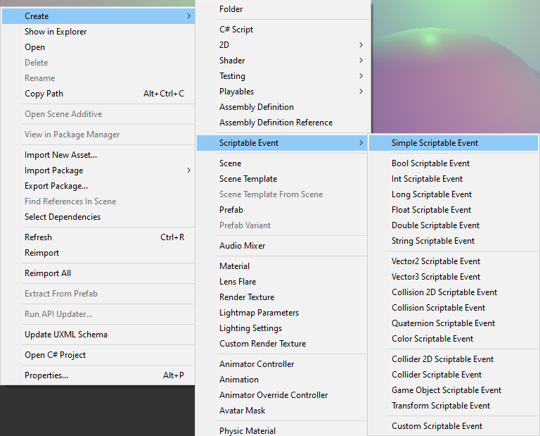
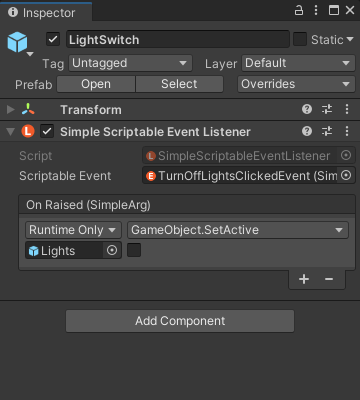
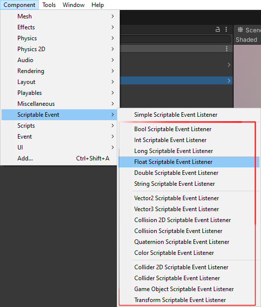
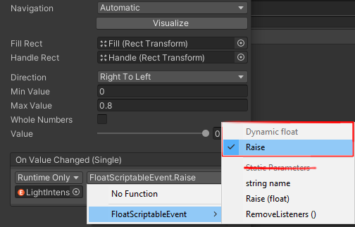
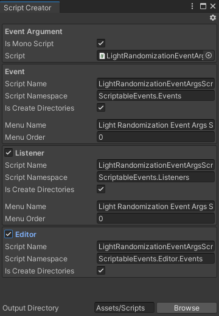
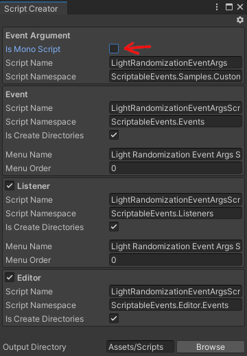
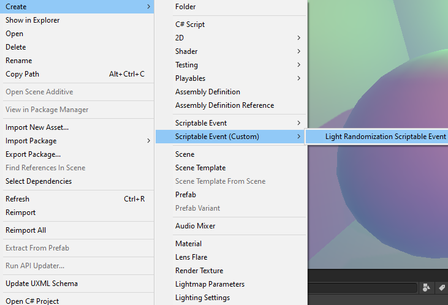

[Unity Package Manager]: https://docs.unity3d.com/Manual/upm-ui.html
[Unity Event]: https://docs.unity3d.com/ScriptReference/Events.UnityEvent.html
[Samples~]: ../Samples%7E
[Simple Events]: ../Samples%7E/SimpleEvents
[Events With Arguments]: ../Samples%7E/EventsWithArguments
[Custom Events]: ../Samples%7E/CustomEvents
[ExecuteInEditMode]: https://docs.unity3d.com/ScriptReference/ExecuteInEditMode.html

# Documentation

## Samples
All features shown here can be imported as samples via [Unity Package Manager] from the [Samples~] directory. When stuck, make sure to investigate the corresponding sample:
<p align="center">
  
</p>

## Getting started
The simplest use case of _Scriptable Events_ is when a system needs to be notified that something has happened without providing any context. To do so, the following elements are necessary:
- _Simple Scriptable Event_ asset which contains listeners and is used to `Raise` the event
- _Simple Scriptable Event Listener_ component which reacts to the event

### How to Raise Events
First, create a _Simple Scriptable Event_ asset by right-clicking in the _Project Window_ and selecting _Create/Scriptable Event/Simple Scriptable Event_. The event asset can be renamed and placed anywhere in the project:
<p align="center">
  
</p>

Next, create a new _GameObject_ in the scene and add a _Simple Scriptable Event Listener_ component:
<p align="center">
  
</p>

Afterwards, do the following:
- Insert event asset into the _Scriptable Event_ field
- Insert Game Objects which should be triggered into the _On Raised_ [Unity Event] field
- Select the methods which should be triggered by the event

For example, if you wanted to turn off a light, the listener setup might be as follows (as seen in [Simple Events] sample):
<p align="center">
  
</p>

Now that the listener is ready, the event needs to be raised. This can be done in multiple ways:
- Using a [Unity Event] and selecting, adding a `ScriptableEvent` asset and selecting the `SimpleScriptableEvent.Raise()` method
- Clicking the _Raise_ button in on the event asset
- Clicking the _Raise_ button next to a specific listener on the event asset

<p align="center">
  
  
</p>

### How to Trigger Events in Custom Components
In most cases events will be raised from custom components. The recommended way to do so is to define a [Unity Event] field and raise the event through it. This approach will give the most flexibility but will be harder to debug:
```cs
using ScriptableEvents.Events;
using UnityEngine;

public class TriggerEvent : MonoBehaviour
{
    [SerializeField]
    private UnityEvent onTriggered;

    private void Start()
    {
        onTriggered.Invoke();
    }
}
```

Alternatively, the event asset can be directly referenced and the `SimpleScriptableEvent.Raise` method can be called to trigger it. This provides better traceability but is less flexible than the [Unity Event] approach:
```cs
using ScriptableEvents.Events;
using UnityEngine;

public class TriggerEvent : MonoBehaviour
{
    [SerializeField]
    private SimpleScriptableEvent scriptableEvent;

    private void Start()
    {
        scriptableEvent.Raise();
    }
}
```

## Passing Arguments
Often systems will require some context when they're being invoked. To solve this, this package provides a set of events with commonly used types which can be used to carry information.

### How to Trigger Events with Arguments
To create an event asset which carries information, right-click in the _Project Window_ and select an event with a specific type from _Create/Scriptable Event/*_ menu:
<p align="center">
  
</p>

Next, a listener for this specific event type must be added into the scene. Each _Scriptable Event_ type contains a corresponding listener component. These typed event listeners work the same way as _Simple Scriptable Event Listener_ components. The only difference is that you must select a **dynamic** method when raising the event from a [Unity Event], otherwise the event will always receive the same value:
<p align="center">
  
  
</p>

To raise the event, follow the same steps as with _Simple Scriptable Event_. Again, make sure to select a **dynamic** `Raise` method:
<p align="center">
  
</p>

A more concrete example of this can be seen in [Events With Arguments] sample.

### How to Raise Events with Arguments in Custom Components
When raising events with arguments in code, it is also recommended to use [Unity Event] fields. However, when defining the event field, type information needs to be specified as well:
```cs
using UnityEngine;
using UnityEngine.Events;

public class TriggerEvent : MonoBehaviour
{
    [SerializeField]
    private UnityEvent<float> onTriggered;

    private void Start()
    {
        // Argument value.
        var value = 1.0f;

        onTriggered.Invoke(value);
    }
}
```

Alternatively, the event asset can be referenced and the `SimpleScriptableEvent.Raise(TArg)` method can be called to raise the event:
```cs
using ScriptableEvents.Events;
using UnityEngine;

public class TriggerEvent : MonoBehaviour
{
    [SerializeField]
    private FloatScriptableEvent scriptableEvent;

    // Also works:
    // [SerializeField]
    // private BaseScriptableEvent<float> scriptableEvent;

    private void Start()
    {
        // Argument value.
        var value = 1.0f;

        scriptableEvent.Raise(value);
    }
}
```

## Creating Custom Events
In some cases using the built-in events and listeners is not sufficient. This can happen when your systems need to handle custom data types, and you want to carry a large chunk of information in one burst. To integrate a custom data type into the Scriptable Event system, the following scripts are necessary:
- The custom data type script
- _Scriptable Event_ asset script
- _Scriptable Event Listener_ script (optional if subscribing manually)
- _Scriptable Event Editor_ script (optional)

To simplify script creation workflow, this package provides a _Script Creator_ tool which can be used to automate this process.

To demonstrate this tool, lets assume that we need to integrate the data type which looks like the following and exists in a script named `LightRandomizationEventArgs.cs`:
```cs
public class LightRandomizationEventArgs
{
    public float Intensity { get; set; }

    public Color Color { get; set; }
}
```

Then we need to tell the _Script Creator_ that this script should be used as a base for our events and listeners. To do so, right-click this script and select _Create/Scriptable Event/Custom Scriptable Event_:

<p align="center">
  
</p>

This will open the _Script Creator_ window:

<p align="center">
  
  
</p>

The _Script Creator_ window provides a set of options which can be used to tailor the event script creation to the specifics of your project. Hover over each entry in the window to see an **explanation tooltip** if you're confused as to what each field means. Additionally, click the gear icon to **configure the defaults** for this window.

Having said that, if we made some adjustments and clicked the **Create** button in this specific example, we would end up with the following scripts (as seen in [Custom Events] sample).

### Scriptable Event Script
The event itself, this script creates the actual Scriptable Event asset:
```cs
using UnityEngine;

namespace ScriptableEvents.Events
{
    [CreateAssetMenu(
        fileName = "LightRandomizationScriptableEvent",
        menuName = ScriptableEventConstants.MenuNameCustom + "/Light Randomization Scriptable Event",
        order = ScriptableEventConstants.MenuOrderCustom + 0
    )]
    public class LightRandomizationScriptableEvent : BaseScriptableEvent<LightRandomizationEventArgs>
    {
    }
}
```

### Scriptable Event Listener Script
The listener which is triggered by the event asset:
```cs
using UnityEngine;

namespace ScriptableEvents.Events
{
    [AddComponentMenu(
        ScriptableEventConstants.MenuNameCustom + "/Light Randomization Scriptable Event Listener",
        ScriptableEventConstants.MenuOrderCustom + 0
    )]
    public class LightRandomizationScriptableEventListener : BaseScriptableEventListener<LightRandomizationEventArgs>
    {
    }
}
```

### Scriptable Event Editor Script
Finally, the optional editor script, which adds the _Raise_ button functionality to the custom event. However, note that the code here is just a placeholder, you will have to construct the UI to input the event arguments manually:
```cs
using ScriptableEvents.Editor;
using UnityEditor;
using UnityEngine;

namespace ScriptableEvents.Editor.Events
{
    [CustomEditor(typeof(LightRandomizationScriptableEvent))]
    public class LightRandomizationScriptableEventEditor : BaseScriptableEventEditor<LightRandomizationEventArgs>
    {
        protected override LightRandomizationEventArgs DrawArgField(LightRandomizationEventArgs value)
        {
            // Use EditorGUILayout.TextField, etc., to draw inputs next to Raise button on the
            // LightRandomizationEventScriptableEvent asset.
            return value;
        }
    }
}
```

The input fields for this specific example, to have the _Raise_ functionality, can be added in the following way (as seen in [Custom Events] sample):
```cs
using ScriptableEvents.Editor;
using UnityEditor;
using UnityEngine;

namespace ScriptableEvents.Editor.Events
{
    [CustomEditor(typeof(LightRandomizationScriptableEvent))]
    public class LightRandomizationScriptableEventEditor : BaseScriptableEventEditor<LightRandomizationEventArgs>
    {
        protected override LightRandomizationEventArgs DrawArgField(LightRandomizationEventArgs value)
        {
            if (value == null)
            {
                value = new LightRandomizationEventArgs();
            }

            EditorGUILayout.BeginVertical();
            value.Intensity = EditorGUILayout.FloatField("Intensity", value.Intensity);
            value.Intensity = Mathf.Max(0, value.Intensity);

            value.Color = EditorGUILayout.ColorField("Color", value.Color);
            EditorGUILayout.EndVertical();

            return value;
        }
    }
}
```

Finally, in order to create the event asset for the newly generated script, select _Create/Scriptable Events (custom)/Light Randomization Scriptable Event Listener_:

<p align="center">
  
</p>

## Manually Subscribing to Events
It is recommended to use pre-defined and custom listener components to subscribe to events via the Editor. However, when traceability is important, subscribing to events manually via non-listener components is preferable.

There are two approaches that can be used to subscribe to an event manually, the first one is implementing `IScriptableEventListener<TArg>` and calling `AddListener(this)` (don't forget to call `RemoveListener(this)` to avoid memory leaks):
```cs
public class CustomEventListener : MonoBehaviour, IScriptableEventListener<float>
{
    [SerializeField]
    private FloatScriptableEvent scriptableEvent;

    // Also works:
    // [SerializeField]
    // private BaseScriptableEvent<float> scriptableEvent;

    private void OnEnable()
    {
        scriptableEvent.AddListener(this);
    }

    private void OnDisable()
    {
        scriptableEvent.RemoveListener(this);
    }

    public void OnRaised(float value)
    {
        // Handle event...
    }
}
```

The second approach is more flexible and allows to specify any method that matches the event type via the `AddListener(Action<TArg>)` overload (again don't forget to call the `RemoveListener(Action<TArg>)` to avoid memory leaks):
```cs
public class CustomEventListener : MonoBehaviour
{
    [SerializeField]
    private FloatScriptableEvent scriptableEvent;

    // Also works:
    // [SerializeField]
    // private BaseScriptableEvent<float> scriptableEvent;

    private void OnEnable()
    {
        scriptableEvent.AddListener(OnRaised);
    }

    private void OnDisable()
    {
        scriptableEvent.RemoveListener(OnRaised);
    }

    private void OnRaised(float value)
    {
        // Handle event...
    }
}
```

Note that when using these approaches to subscribe to events, some functionality in the custom Editor inspectors that are included in this package might not work. For example, the functionality to click on `UnityEngine.Object` references in _Scriptable Event_ assets, as it relies on the listeners being of type `UnityEngine.Object`.
